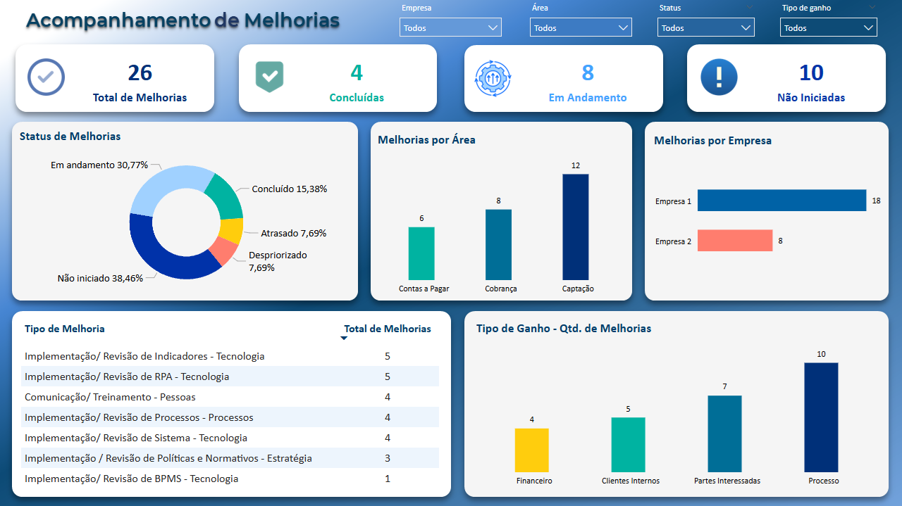

## Descrição

Este projeto apresenta um painel interativo desenvolvido no Power BI, com o objetivo de acompanhar a evolução de melhorias solicitadas por diferentes áreas e empresas. O painel permite uma visão estratégica e rápida do status de execução das iniciativas, facilitando a tomada de decisões gerenciais.
- Link Power BI online: https://abrir.link/BeLcW

  

#### Há Tooltips na tabela "Tipo de Melhoria". Passe o mouse nos valores.

### 🎯 Objetivo
Fornecer uma visualização clara e dinâmica do andamento das ações de melhoria dentro da organização, respondendo às principais necessidades do time de gestão.

### Análise das Melhorias - Perguntas respondidas
#### Quantas melhorias foram solicitadas?
  
Foram registradas 26 melhorias, abrangendo diferentes áreas e empresas.

#### Qual o status das melhorias?

Não iniciadas: 10 (38%)

Em andamento: 8 (31%)

Concluídas: 4 (15%)

Atrasadas e despriorizadas: 4 (16% no total)

#### Quais áreas mais demandam melhorias?
  
A área de Captação lidera com 12 solicitações, seguida por Cobrança (8) e Contas a Pagar (6).

#### Quais são os principais tipos de melhoria?

Implementação/ Revisão de Indicadores - Tecnologia: 5 solicitações

Implementação/ Revisão de RPA - Tecnologia: 5 solicitações

Comunicação/ Treinamento - Pessoas: 4 solicitações

#### Quais são os tipos de ganho esperados com as melhorias?

Ganho em Processos: 10 melhorias

Impacto em Partes Interessadas: 7 melhorias

Atendimento a Clientes Internos: 5 melhorias

Ganho Financeiro: 4 melhorias

### 🛠️ Ferramentas Utilizadas
Power BI

Power Query

Modelagem Relacional

DAX (Data Analysis Expressions)

### 💡 Insights e Benefícios
Este painel proporciona:

Visão consolidada de iniciativas de melhoria;

Acompanhamento por status, área, empresa e tipo de ganho;

Apoio à priorização de ações e gestão estratégica de resultados.

